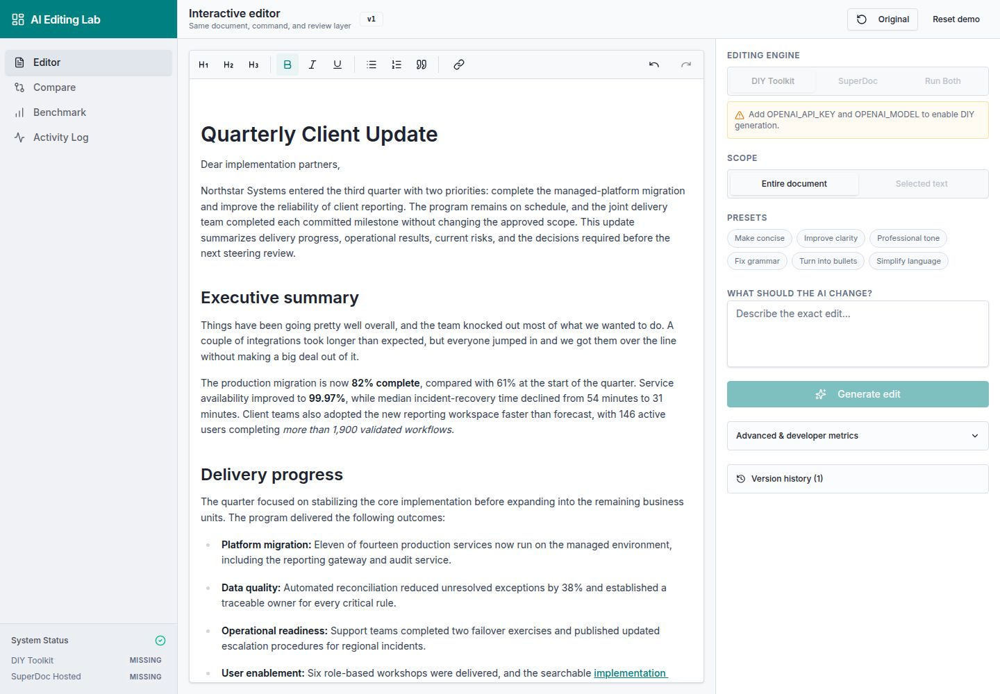

# AI Editing Lab

**DIY editor toolkit versus hosted document editing**

Built by **itishnkj** for the SuperDocs Task 2 assigned build:
**“Editor toolkit plus your own model versus a hosted editing harness.”**

This submission serves product engineers who already have a rich-text editor and
need to add AI editing without losing control of review, document state, or
operational evidence.



> Public contribution path: `extensions/itishnkj/ai-editing-lab/` in
> [`superdocsapp/superdocs-builds`](https://github.com/superdocsapp/superdocs-builds).
> This README and source bundle are intended for the pull request from the
> `itishnkj` GitHub account; no email address is included in the repository.

## What this build demonstrates

The same editing experience is implemented against two independent engines:

1. **DIY toolkit arm**
   - TipTap provides the editor and document model.
   - An OpenAI-compatible model receives an owned prompt and structured JSON
     response contract.
   - The server validates the response, performs one bounded repair attempt,
     sanitizes HTML, and normalizes it into the shared review model.
2. **SuperDocs Hosted arm**
   - The server calls the SuperDocs asynchronous editing API.
   - `approval_mode: "ask_every_time"` keeps the provider review boundary
     explicit.
   - Bounded polling surfaces pending chunk proposals in the same review UI.
   - Accept and reject decisions are sent explicitly; no proposal is silently
     applied.

Both arms share the TipTap editor, instruction composer, frozen edit scope,
proposal review cards, version history, compare view, benchmark view, activity
telemetry, cost/context telemetry, and exportable evidence.

## Comparison study

The resilience run and the matched sample answer different questions:

- **Resilience run:** 100 DIY prompts across two synthetic DOCX imports. This
  measures the DIY pipeline’s request completion and basic output safety, not
  a provider comparison.
- **Matched sample:** three identical prompt/document pairs were sent to both
  engines. This is a small, structural/API comparison only; it does not
  establish semantic quality, provider cost, or general performance.

| Case | Shared document request | DIY result | Hosted result | Observation |
| --- | --- | --- | --- | --- |
| Concision | Concise the executive summary without unrelated changes | valid proposal, 33.1s | valid review proposal, 20.5s | Both completed; hosted review was explicitly rejected. |
| Table edit | Add percentage improvement to Table 1 | valid proposal, 27.7s | valid review proposal, 25.6s | Both completed; hosted review was explicitly cancelled. |
| Multilingual edit | Translate only the Hindi bullet | valid proposal, 29.8s | valid review proposal, 19.0s | Both completed; hosted review was explicitly rejected. |

All six responses passed the harness’s structural and unsafe-markup checks.
“Did it?” and “Only that?” remain deliberately **unverified** until a human
reviews the rendered proposal against the request. The three-case hosted
latency result is an observation, not a winner declaration.

### Code and maintenance trade-offs

| Concern | DIY toolkit + owned model | SuperDocs Hosted |
| --- | --- | --- |
| App-owned adapter code | 4 files / ~373 lines | 3 files / ~741 lines, including async review broker |
| Model contract | Owned prompt, JSON parser, one repair path | Hosted API request/review contract |
| Review safety | Local proposal validated before mutation | Provider review is explicit with `approval_mode: "ask_every_time"` |
| Token visibility | Recorded when the provider returns usage | Not reliably exposed per request; reported as unavailable |
| Ongoing maintenance | Model/provider changes are owned by the application team | Hosted job, review, and API contract changes are the integration boundary |

The toolkit route is the better choice when a team needs a model the hosted
surface does not offer, must own an unusual structured output contract, needs
on-premises or region-specific inference, or wants to tightly couple editing
behavior to an existing product-specific retrieval/tooling system.

Its cost is concrete: a model upgrade can break JSON-mode support, field names,
tool/response formatting, context-window assumptions, token accounting,
refusal behavior, or HTML fidelity. The DIY parser, bounded repair step,
sanitizer, prompt tests, and telemetry must be updated and revalidated when
those behaviors change. SuperDocs removes that model-facing maintenance but
introduces hosted asynchronous jobs and a provider-owned approval workflow.

## Included in this folder

```text
app/                 React + Vite editor, assistant, comparison UI, imports,
                     history, telemetry, and frontend tests
api/                 Express routes and the DIY/SuperDocs engine adapters
shared/              API client, generated contracts, and database schema
screenshots/         Desktop, mobile, and benchmark views
evidence/            100-prompt report and per-prompt CSV results
```

The source is a snapshot of the working pnpm workspace used for the build.
The original workspace keeps the `@workspace/*` package aliases used by the
frontend and API packages; this submission folder intentionally contains no
`node_modules`, build output, credentials, or private environment values.

## Running the build

Use the source snapshot in a pnpm workspace, or copy these folders into an
existing workspace and preserve the `@workspace/api-client-react`,
`@workspace/api-zod`, and `@workspace/db` package names.

Server-side configuration:

```text
OPENAI_API_KEY=your-server-side-key
OPENAI_MODEL=your-openai-compatible-model
SUPERDOCS_API_KEY=your-server-side-key
SUPERDOCS_BASE_URL=https://api.superdocs.app
CLERK_SECRET_KEY=your-server-side-key
```

Client-side configuration:

```text
VITE_CLERK_PUBLISHABLE_KEY=your-publishable-key
```

Run the API and web services with the workspace scripts:

```bash
pnpm --filter @workspace/api-server run dev
pnpm --filter @workspace/ai-editing-lab run dev
```

Provider credentials stay on the server. Do not put any of the values above in
the repository, browser storage, screenshots, or a public issue.

## How the evaluation was run

The torture run used two imported synthetic DOCX documents and prompts 1–100:

- prompts 1–56: Doc A
- prompts 57–91: Doc B
- prompts 92–100: combined A+B HTML payloads, because the current edit API
  accepts one document payload per request

Before the resilience run, the declared cap was 100 DIY requests plus three
representative SuperDocs requests. It used exactly those 103 requests. A
separate three-request DIY cap was then declared to create the matched sample
above using the exact same document/prompt inputs as the completed SuperDocs
representative cases. Total logged provider requests: **106**.

- **DIY:** 100/100 API-complete
- **SuperDocs:** 3/3 API-complete
- **Unsafe markup:** 0
- **Structurally valid outputs:** 103/103
- **DIY P50/P95 latency:** 30.8s / 49.3s
- **SuperDocs P50/P95 latency:** 20.5s / 25.6s
- **Matched DIY P50/P95 latency:** 29.8s / 33.1s

The provider responses did not expose reliable per-request dollar spend, so no
cost number is fabricated. The app records available token and response
metadata and labels unavailable cost values honestly.

## Limitations found

The DOCX importer reports and currently drops or warns about some advanced
document features, including MathML, embedded images, custom quote/code styles,
comments metadata, and some tab/run-style metadata.

The current app exposes text and evidence downloads, but not native DOCX/PDF
export. Consequently, export survival is marked `not_available` in the report,
not passed by assumption.

The automated checks prove API completion, output shape, non-empty proposals,
and basic safety. They do not prove semantic correctness or that unrelated
content was untouched. Those claims require human review against each prompt.

## Evidence

- [`evidence/torture-test-report.md`](evidence/torture-test-report.md) —
  methodology, importer findings, summary, categories, and per-prompt results
- [`evidence/torture-test-results.csv`](evidence/torture-test-results.csv) —
  machine-readable result table
- [`evidence/matched-comparison-sample.json`](evidence/matched-comparison-sample.json) —
  exact request inputs and API/structural observations for the three matched
  cases

## Attribution

I built this for the SuperDocs Task 2 engineering comparison assignment.